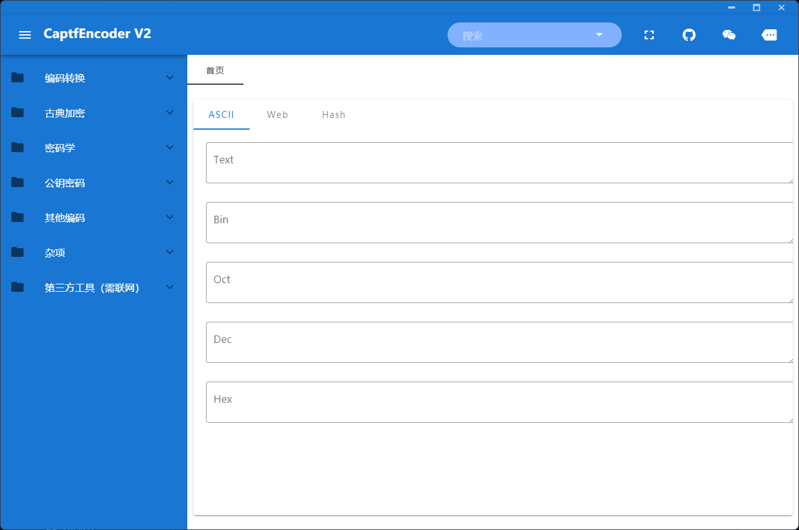

# 说明

这是一个密码学综合工具，2.1.0版本的UI是比3.0的好看很多的，并且功能貌似更全，不过停止更新了。

原GitHub地址是https://github.com/guyoung/CaptfEncoder

Linux下载：https://github.com/guyoung/CaptfEncoder/releases/download/2.1.0/CaptfEncoder-linux-x64-2.1.0.zip

Mac下载：https://github.com/guyoung/CaptfEncoder/releases/download/2.1.0/CaptfEncoder-darwin-x64-2.1.0.zip